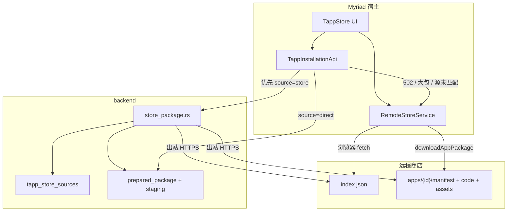

# Tapp 商店（远程目录与安装）

本文是 **远程 Tapp 商店** 的开发与发布契约：目录格式（`index.json`）、源管理、安装/更新链路、包布局与发布检查清单。

| 相关文档 | 用途 |
| -------- | ---- |
| [架构总览](ARCHITECTURE.md) | 安装态、staging、所有权与可见性 |
| [Manifest 配置](MANIFEST.md) | 包内字段、分类、assets、权限 |
| [`.tapp` 文件格式](../../features/TAPP_FILE_FORMAT.md) | ZIP 安装包布局（文件安装） |
| [REST API](REST_API.md) | 宿主 `/api/tapps/*` 端点 |
| [快速入门](QUICKSTART.md) | 本地开发与 CLI 打包 |
| 官方仓库 | [Myriad-You/tapp-store](https://github.com/Myriad-You/tapp-store)（仓库 README 与 `development/tapp/` 镜像本协议） |

**术语**

- **商店源（Store Source）**：一条已配置的目录 URL（通常指向 `index.json`），存在 PostgreSQL `tapp_store_sources`。
- **商店索引（Catalog / index.json）**：该源托管的应用清单与下载路径。
- **安装模式 `source`**：REST body 字段，取值 `store` | `direct`（还有独立的 `install-file`）。
- **`storeSource`**：商店安装时指定的 **源 id 或目录 URL**，**不是** 字面量 `"store"`。

不存在 `/api/tapp-store/...` 路由；商店管理挂在 `/api/tapps/store/*` 与 `/api/tapps/install`。

---

## 一句话模型

1. 管理员配置商店源（官方源由迁移预置）。
2. 浏览器经 `RemoteStoreService` 直连各源 `index.json` 展示列表（5 分钟内存缓存）。
3. 用户安装时优先 `POST /api/tapps/install`（`source=store`），由后端出站下载包并写入安装态。
4. 后端不可达外网、大包（≥ 1 MiB）或匹配失败时，宿主回退为 **浏览器下载 + `source=direct`**。
5. 最终安装态与 direct / 文件安装 **相同**：DB 元数据 + `data/tapps/{owner}/{tappId}/` 资源。



---

## 官方商店

| 项 | 值 |
| -- | -- |
| 仓库 | https://github.com/Myriad-You/tapp-store |
| 目录 URL（预置官方源） | `https://raw.githubusercontent.com/Myriad-You/tapp-store/main/index.json` |
| `base_url` | `https://raw.githubusercontent.com/Myriad-You/tapp-store/main` |
| 预置 | 迁移 `002_tapp_system` 写入 `tapp_store_sources`，`official=true`，默认启用 |

前端降级常量 `OFFICIAL_STORE`（`RemoteStoreService`）在 API 不可用时仍指向同一 URL。

当前官方应用目录示例（以仓库 `index.json` 为准）：`com.myriad.music-player`、`com.myriad.quick-notes`、`com.myriad.config-generator`、`com.myriad.doudizhu`、`com.myriad.aro`、`com.myriad.cdn-cache`。内置演示仅 `helloWorld`；完整应用经商店安装，不随 Myriad 前端打包。

---

## 商店源管理

### 数据与权限

| 操作 | 路由 | 身份 |
| ---- | ---- | ---- |
| 列出源 | `GET /api/tapps/store/sources` | 可选认证（公开可读） |
| 添加源 | `POST /api/tapps/store/sources` | 登录 + **管理员** |
| 更新源 | `POST /api/tapps/store/sources/{sourceId}` | 登录 + **管理员** |
| 删除源 | `DELETE /api/tapps/store/sources/{sourceId}` | 登录 + **管理员** |

响应 DTO（camelCase）：

```json
{
  "id": 1,
  "name": "Myriad 官方商店",
  "description": "官方应用商店…",
  "url": "https://raw.githubusercontent.com/Myriad-You/tapp-store/main/index.json",
  "enabled": true,
  "official": true,
  "icon": "🏪"
}
```

约束：

- 添加时 `url` 全局唯一，冲突返回 `409`。
- 非官方源可改 URL；**官方源禁止修改 URL**（`403`）。
- 删除官方源由 handler 拒绝；前端也会拦截。
- 禁用的源不参与 `fetchAllApps` / 商店 UI 聚合。

代码位置：

| 层 | 路径 |
| -- | ---- |
| 路由装配 | `backend/src/api/tapp_store.rs` |
| 源 CRUD | `backend/src/api/tapp_store/store_sources.rs` |
| 商店拉包 | `backend/src/api/tapp_store/store_package.rs` |
| 前端源与目录 | `frontend/src/tapp/services/RemoteStoreService.ts` |
| 商店 UI | `frontend/src/tapp/components/TappStore.tsx` |
| 安装入口 | `frontend/src/tapp/services/TappInstallationApi.ts` |

---

## 目录协议：`index.json`

### 顶层字段

与官方仓库当前索引对齐（前端类型见 `RemoteStoreIndex`；后端按 JSON 宽松解析 `apps` / `download`）：

| 字段 | 类型 | 说明 |
| ---- | ---- | ---- |
| `$schema` | string | 可选；官方使用 `https://myriad.app/schemas/tapp-store-v1.json` |
| `name` | string | 商店名称（前端校验必填） |
| `version` | string | 目录自身版本（元数据） |
| `api_version` | string \| number | 协议版本提示；官方当前为 `"2"` |
| `base_url` | string | 解析相对下载路径的根（无尾斜杠） |
| `updated_at` / `last_updated` | string | 更新时间（ISO）；两种键名并存时优先读实际文件 |
| `maintainer` | object | 可选维护者信息 |
| `apps` | array | **必填** 应用列表 |
| `categories` | array | 可选；UI 分类提示。**权威分类 ID 以 Manifest / 应用条目 `category` 为准** |

### 应用条目（`apps[]`）

| 字段 | 必填 | 说明 |
| ---- | ---- | ---- |
| `id` | ✅ | 与 `manifest.id` 一致，反向域名 |
| `name` | ✅ | 展示名（可被 `locales` 覆盖） |
| `version` | ✅ | 应与 `manifest.version` 同步 |
| `description` | ✅ | 短描述 |
| `long_description` | ❌ | 详情长文案 |
| `locales` | ❌ | BCP-47 → `{ name?, description? }`，同 Manifest 规则 |
| `author` | ✅ | `{ name, email?, url? }` |
| `category` | ✅ | 稳定用途 ID；**安装时必须与 Manifest 分类一致**（含旧别名规范化后） |
| `permissions` | ✅ | 申请权限列表（展示与安装同意用） |
| `download` | ✅ | 相对 `base_url` 的下载路径表 |
| `icon` / `icon_svg` | ❌ | emoji/URL 或内联 SVG（`icon_svg` 优先） |
| `theme_color` | ❌ | `#RRGGBB` |
| `tags` | ❌ | 搜索标签；`demo` / `test` 用标签表达发布阶段 |
| `license` / `homepage` / `repository` | ❌ | 元数据 |
| `screenshots` | ❌ | URL 列表 |
| `preview` | ❌ | 商店专用静态预览场景；不会进入运行时 Manifest |
| `size` | ❌ | 字节；**≥ 1 MiB 时宿主强制走客户端下载** 以便进度条 |
| `featured` / `verified` | ❌ | UI 徽章 |
| `created_at` / `updated_at` | ❌ | ISO 时间 |

### 静态预览 `preview`

`preview` 由应用在目录条目中可选声明，只用于商店精选卡与详情页。宿主优先加载声明的
HTML/CSS；未声明时回退到清洗后的 `download.page_template`，仍不可用时显示主题色占位。

~~~json
{
  "preview": {
    "version": 1,
    "type": "snapshot",
    "html": "apps/com.example.notes/preview.html",
    "styles": [
      "apps/com.example.notes/page.css",
      "apps/com.example.notes/preview.css"
    ],
    "viewport": { "width": 1440, "height": 900 },
    "fit": "cover",
    "focus": { "x": 0.5, "y": 0.45 },
    "theme": "dark"
  }
}
~~~

| 字段 | 约束 |
| ---- | ---- |
| `version` / `type` | 当前固定为 `1` / `"snapshot"` |
| `html` | 必需；相对 `base_url` 的静态 HTML |
| `styles` | 最多 8 个静态 CSS 路径；按声明顺序合并 |
| `viewport` | 宽 `1280..3840`、高 `720..2160`；宿主不会使用低分辨率画布 |
| `fit` | `cover`（默认）或 `contain` |
| `focus` | 裁切焦点，`x` / `y` 均为 `0..1` |
| `theme` | `auto`（默认）、`light` 或 `dark` |

预览必须只包含公开、虚构或脱敏数据，并优先复用正式页面的结构与样式。商店会再次删除
脚本、链接、外部资源和事件；显式快照中的表单控件只保留静态外观，并用禁止网络、导航、
提交和指针交互的 iframe 渲染。预览错误只影响展示，**不得阻断安装**。

### `download` 路径表

路径均相对于 `base_url`（或绝对 `http(s)://`）。商店索引路径是 **仓库级定位**；`manifest.main` 是 **安装目录内** 入口。二者字符串不必相同，但必须指向同一份入口代码。

| 键 | 说明 |
| -- | ---- |
| `manifest` | ✅ `manifest.json` |
| `code` | ✅ 主入口 JS（常见 `main.js`；历史包可为 `index.js`） |
| `readme` | 可选 README |
| `styles` | 统一 CSS（`cssMode: unified`） |
| `widget_styles` | Widget 专用 CSS |
| `page_styles` | Page 专用 CSS；**Manifest 声明了 `pageStyles` 时索引必须给出且文件必须可下载** |
| `page_template` | Page HTML；**声明了 `pageTemplate` 时必填** |
| `widget_templates` | `widgetId → { size → path }` |
| `i18n` | `lang → path`（JSON 文件） |
| `page_modules` | **安装后模块文件名** → 商店相对路径，如 `"index.js": "apps/.../page/index.js"` |

**二进制 assets 不进 `download` 表。** 安装器根据 `manifest.assets`，用包根（`code` 或 `manifest` 路径的父目录）拼接：

```text
{base_url}/{packageRoot}/{assetPath}
# 例: …/apps/com.myriad.doudizhu/assets/felt/table_felt.png
```

包根解析见 `storePackageRoot` / `store_package_root`（`main.js` 的父目录）。

### 分类 ID

与 [Manifest · 应用分类](MANIFEST.md#应用分类) 相同：

`ai` · `data` · `developer` · `game` · `media` · `productivity` · `social` · `utility`

- 不要用 `games` / `tools` / `music` 等旧别名写新包（宿主会规范化，但新发布应直接用规范 ID）。
- `Page` / `Widget` / headless 是运行形态，不是 `category`。
- 索引 `category` ≠ Manifest `category` → 后端 **拒绝商店安装**。

### 最小合法示例

```json
{
  "name": "My Example Store",
  "api_version": "2",
  "base_url": "https://example.com/tapp-catalog",
  "apps": [
    {
      "id": "com.example.notes",
      "name": "Notes",
      "version": "1.0.0",
      "description": "A note-taking Tapp",
      "author": { "name": "Example" },
      "category": "productivity",
      "permissions": ["storage", "widget:register"],
      "download": {
        "manifest": "apps/com.example.notes/manifest.json",
        "code": "apps/com.example.notes/main.js",
        "page_styles": "apps/com.example.notes/page.css",
        "page_template": "apps/com.example.notes/page.html",
        "widget_styles": "apps/com.example.notes/widget.css",
        "widget_templates": {
          "notes": {
            "4x2": "apps/com.example.notes/widget-4x2.html"
          }
        }
      }
    }
  ]
}
```

---

## 仓库布局（官方与第三方源）

推荐与官方仓库一致：

```text
tapp-store/
├── index.json                 # 目录入口（Myriad 源 URL 指向这里）
├── categories.json            # 可选 UI 元数据（非安装权威）
├── README.md
└── apps/
    └── com.example.app/
        ├── manifest.json      # 必需
        ├── main.js            # 入口（或 index.js，须与 download.code 一致）
        ├── page.html          # 可选
        ├── page.css
        ├── widget.css
        ├── widget-4x2.html
        ├── styles.css
        ├── README.md
        ├── assets/            # manifest.assets 声明的二进制
        │   └── textures/...
        ├── i18n/
        │   └── en-US.json
        └── page/
            ├── state.js
            └── index.js
```

也可用 CLI 打出 `.tapp` 再人工展开到 `apps/` 并登记索引；安装权威仍是后端对 Manifest 与资源的校验，与路径风格无关。

---

## 安装与更新链路

### REST

```http
POST /api/tapps/install
Content-Type: application/json
Cookie: …  X-CSRF-Token: …
```

商店模式：

```json
{
  "source": "store",
  "storeSource": "1",
  "tappId": "com.example.notes",
  "permissions": ["storage", "widget:register"]
}
```

| 字段 | 含义 |
| ---- | ---- |
| `source` | 固定 `"store"` 表示由后端按源拉包 |
| `storeSource` | 源 **数字 id**、完整 `index.json` URL，或规范化后与已配置源匹配的 base URL |
| `tappId` | 索引中的应用 id |
| `permissions` | 用户同意的申请子集；后端与 Manifest 求交写入 `approved_permissions` |

更新：`POST /api/tapps/{tappId}/update`，同样可带 `source: "store"` + `storeSource`。

**禁止** 把 `storeSource` 设为 `"store"` / `"direct"`（安装模式占位符）；后端会 `400`。

### 后端拉包（`store_package.rs`）

1. 按 id / 精确 URL / 规范化 base（去掉尾斜杠与可选 `/index.json`）解析商店源。
2. 出站客户端拉取 `{base}/index.json`（禁止内网/localhost 等；见出站安全）。
3. 在 `apps` 中找 `id == tappId`。
4. 下载 manifest + code + 可选文本资源 + i18n + page_modules。
5. 校验索引与 Manifest **category** 一致。
6. 按 `manifest.assets` 下载二进制为 base64 映射（缺一则失败，避免半安装贴图包）。
7. 进入与 direct 相同的 `PreparedTappPackage` → staging → 原子激活。

后端容器访问不了 `raw.githubusercontent.com` 时返回 **502**；前端列表仍可能正常（浏览器直连）。

### 宿主回退（`installFromStore`）

`TappInstallationApi.installFromStore`：

1. 拒绝 `storeSource` 为模式占位符。
2. 若 `estimatedBytes ≥ 1 MiB`（索引 `size`），**直接** 客户端下载路径。
3. 否则先 `source=store`；失败信息匹配 502 / 无法拉源 / 网络错误 / 源未找到等则回退。
4. 回退：`RemoteStoreService.downloadAppPackage` → `source=direct` 安装。

SDK `Tapp.tappList.install` 与 REST 字段 **不是** 一一同名映射（见
`frontend/src/tapp/utils/tappListInstallRequest.ts`）：

| SDK 请求 | 结果 |
| -------- | ---- |
| `{ source: "store", storeSource: "<id\|url>", tappId }` | 商店安装；`storeSource` 作为 catalog 交给 `installFromStore` |
| `{ source: "https://…/index.json", tappId }` | 商店安装；HTTP `source` 即 catalog（可省略 `storeSource`） |
| `{ source: "1", tappId }` | **失败**（裸非 HTTP `source` 不会当作 catalog） |
| `{ source: "direct", manifest, code, … }` | 直接安装；缺 `manifest`/`code` 失败 |

REST 商店安装仍是 body `source: "store"` + `storeSource: catalogRef`（源 id 或 URL 均可）。

### 进度

`tappInstallProgress` 将大包下载分为 prepare / download / install / done；assets 并发度 4，占用进度条主要区间。商店包体 **不经** sandbox Bridge 传输。

---

## 与 `.tapp` / direct 的关系

| 路径 | 入口 | 包从哪来 |
| ---- | ---- | -------- |
| 商店 | `install` + `source=store`（或浏览器回退 direct） | 远程 `index.json` + 文件树 |
| 直接 | `install` + `source=direct` | 请求体内联 manifest/code/资源 |
| 文件 | `install-file` multipart `file` | ZIP `.tapp` |

三种路径最终校验与落盘规则一致。商店发布可以只维护文件树 + 索引；本地分发可用 CLI `myriad-tapp pack` 产出 `.tapp`。格式见 [TAPP_FILE_FORMAT](../../features/TAPP_FILE_FORMAT.md)。

---

## 发布到商店

### 开发者流程

1. 用 `@myriad/tapp-cli` 初始化、校验、打包（见 [QUICKSTART](QUICKSTART.md)）。
2. 确认 `manifest.json`：`category`、`permissions`、`main`、模板/CSS/assets 路径完整；`version` 语义化。
3. 在目标商店仓库 `apps/{id}/` 放入源文件（入口文件名与索引 `download.code` 一致）。
4. 更新根 `index.json`：版本、权限、`download` 全路径、`size`（大包务必填）、`locales`。
5. 保证 **索引 `category` == Manifest `category`**，**索引 `version` == Manifest `version`**。
6. PR / 推送后，用 Myriad 商店 UI 强制刷新源缓存并试装。

### 索引检查清单

- [ ] `download.manifest` / `download.code` 可 `GET` 且 200
- [ ] Manifest 声明的 `pageStyles` / `pageTemplate` / `widgetStyles` / 每个 widget 模板在索引中有对应路径且文件存在
- [ ] `page_modules` 的 **键** 是安装后文件名（如 `index.js`），值是商店相对路径
- [ ] `manifest.assets` 中每个路径在 `{packageRoot}/assets/...` 可下载
- [ ] `permissions` 与 Manifest 一致；含 Widget 时含 `widget:register`（普通用户安装会过滤特权能力，应用其余部分仍可装）
- [ ] `minSystemVersion`（若声明）仅在 Manifest 维护，索引不要做第二份版本源
- [ ] 路径大小写与托管源一致（GitHub raw 区分大小写）

### 自建商店源

1. 托管静态 `index.json` 与 `apps/**`（HTTPS 推荐；后端拒绝内网主机）。
2. Myriad 管理端 → Tapp Store 源设置 → 添加 URL（指向 `index.json`）。
3. 启用后刷新列表；安装时 `storeSource` 可用新源的 id 或完整 URL。

---

## 前端行为摘要

| 行为 | 实现要点 |
| ---- | -------- |
| 源列表 | `GET /api/tapps/store/sources`；空或失败降级官方 URL |
| 索引 | 浏览器 `fetch(source.url)`，TTL 5 分钟；同 URL 合并在途请求 |
| 源删除/刷新 | 清缓存并 abort 在途请求，避免迟到写回 |
| 多源聚合 | 并行拉启用源，应用带 `sourceUrl` / `sourceName` |
| 安装 UI | `TappStore.tsx` → `installFromStore` |
| 路径工具 | `storePackagePaths.ts` 与后端 `store_package_root` 对齐 |

---

## 后端模块地图（`tapp_store`）

商店相关只是 `backend/src/api/tapp_store/` 的一部分；完整安装/运行见 [ARCHITECTURE](ARCHITECTURE.md)。

| 模块 | 职责 |
| ---- | ---- |
| `store_sources.rs` | 源列表与管理员 CRUD |
| `store_package.rs` | 解析源、下载索引与包、category/assets 校验 |
| `prepared_package.rs` | 结构化/归档包统一校验与资源准备 |
| `installation.rs` | direct/store 安装与更新事务 |
| `package_files.rs` | staging / activate / recovery |
| `validation.rs` | 路径、权限、配额纯校验 |
| `catalog.rs` / `access.rs` | 列表详情与可见性 |
| `lifecycle.rs` | start/stop、最近使用 |
| `storage.rs` / `widgets.rs` | 存储与 Widget 注册表 |

路由前缀：`/api/tapps`（见 `create_tapp_routes`）。运行时 Bridge API 在 `/api/tapp/*`，不要混淆。

---

## 故障排查（商店）

| 现象 | 原因 | 处理 |
| ---- | ---- | ---- |
| 能浏览不能安装 / 502 | 后端无外网 | 依赖客户端回退；或给 backend 出站权限；确认预置源 URL |
| `Store source not found` | `storeSource` 错误或未添加源 | 传源 id 或完整 catalog URL；管理员添加源 |
| `Invalid storeSource: ... install mode` | 把 `"store"` 当源 id | 传数字 id 或 URL |
| category 不匹配 | 索引与 Manifest 分类不一致 | 两边改成同一稳定 ID |
| 缺 page styles / template | 索引漏 `page_styles` / `page_template` | 补路径；文件必须存在 |
| 贴图/音频 404 | assets 未声明或路径不在 `assets/` | Manifest `assets` + 仓库文件与包根拼接规则 |
| 入口 404 | `download.code` 与磁盘文件名不一致 | 对齐 `main.js` / `index.js` |
| 装了旧版 | 浏览器或中间层缓存 | 强制刷新源；检查 `index` 与文件是否已推送 |
| 大包无进度 / 卡住 | 未填 `size` 走服务端路径 | 索引填写真实 `size`（≥1MiB 走客户端） |

更多运行时问题见 [TROUBLESHOOTING](TROUBLESHOOTING.md#商店安装--storesource)。

---

## 变更时同步项

修改商店协议或拉包逻辑时至少核对：

1. 官方 [tapp-store](https://github.com/Myriad-You/tapp-store) 的 `index.json` 与 README；
2. `RemoteStoreService` 类型与下载字段；
3. `store_package.rs` 与客户端 `downloadAppPackage` 对必填资源/assets 行为一致；
4. `TappInstallationApi.installFromStore` 回退条件与大包阈值；
5. 本文、[REST_API](REST_API.md)、[MANIFEST](MANIFEST.md) 分类与路径规则；
6. 后端商店/安装定向测试与前端相关单测（`storePackagePaths`、`tappInstallProgress` 等）。
